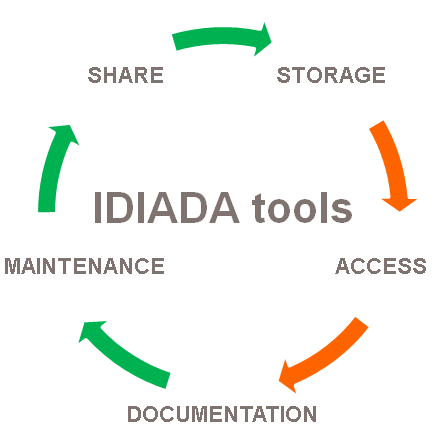

pyProjectTools documentation
============================
    
.. toctree::
   :maxdepth: 2
    

    
pyProjectTools is a package of tools which are intented to be used to create, install, document and share python-based scripts.

Available tools
---------------

.. toctree::
   :maxdepth: 1
   
   newPyProject.rst
   pyProjectInstaller.rst
   doc.rst

General functionality
---------------------

usage::

    pyProjectTools [-h] [-initiateAnsaToolkit] [-initiateDoc]
    
    optional arguments:
      -h, --help            show this help message and exit
      -initiateAnsaToolkit  Initiates ansa_toolkit data structure (a package for
                            user user script buttons, plugins and checks loading
                            to ANSA).
      -initiateDoc          Initiates IDIADA tools documentation data structure.
    
Revision history
----------------

Application revision history overview.

.. toctree::
   :maxdepth: 2

   revision_history