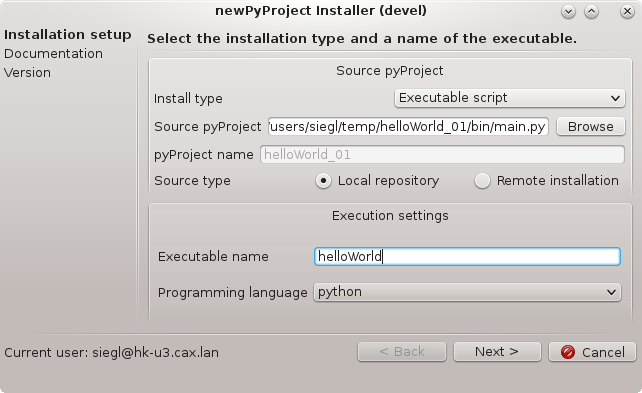

.. toctree::
   :maxdepth: 1

pyProjectInstaller
==================

    
Python script for pyProject installation. According to the given 
installation type (executable script, ANSA button, ANSA check, META button) handles
all corresponding procedures:

* installs pyProject to the default project structure
* installs a default sphinx documentation based on main.py documentation string
* handles the git repository versions

Usage
-----

usage::

    pyProjectInstaller 

It is possible to use either "Local repository" or "Remote installation" 
as a source for installation.
    
    * Local repository type - pyProject to be installed has its repository (by script development)
    * Remote installation type - pyProject to be installed has been received from other business unit (by installation of an existing tool)
